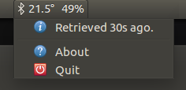

# bluetooth-module-indicator [](https://opensource.org/licenses/MIT)

Ubuntu debian package deployment of a Menubar indicator for direct display of bluetooth modules' transparent app registers.
Compatible with generic modules such as JDY-16, HC-08.

## Installation
```
sudo add-apt-repository ppa:mihaigalos/ppa
sudo apt-get update
sudo apt install bluetooth-module-indicator
netatmo-indicator &
```

## Removal
```
sudo apt remove --purge bluetooth-module-indicator
```

## Screenshots


###### Sources
```
git clone --recursive https://github.com/mihaigalos/bluetooth-module-indicator.git
```
